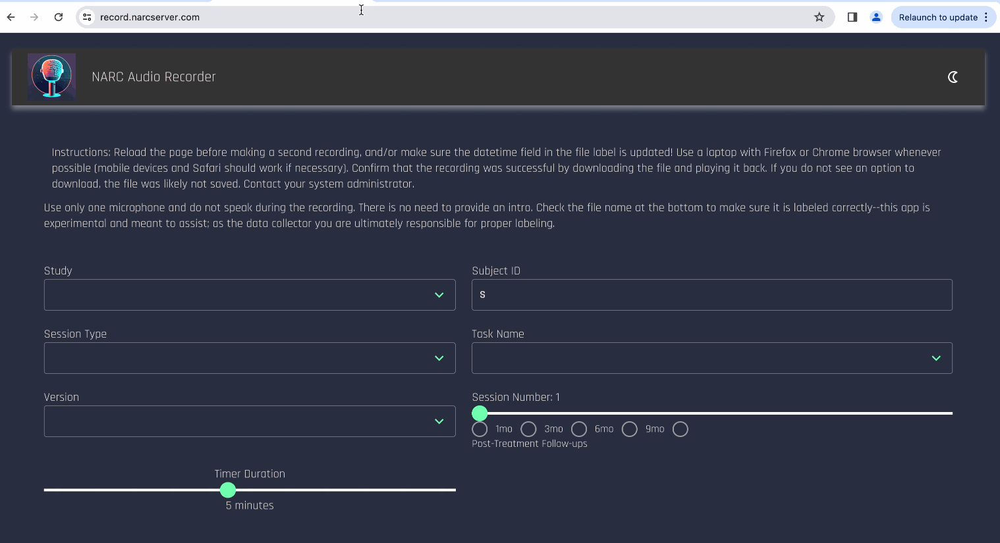

# Web Based Audio Recording

Record audio from a web browser and label files in Brain Imaging Data Structure (BIDS)



Converts .webm, .ogg, and all other formats to .mp3 and saves the mp3 file to the server at /app/data/audio and to the user's host machine. 

This app is comprised of two docker containers, and tested to work with Azure Container Instances, although any host with a storage volume to mount to the container should work.

## Configuration
In the storage volume that you mount, you will need to have the following folders and files:

```
/data
  ./config
  ./ssl
  ./audio
  ./uploads
```

### Hot-reloadable site config 


`/config` 

  - studyOptions.json 

    - data file containing options you want to appear in the study drop-down menu, and the short code for it (recommended 4 letters)

  - sessionOptions.json - 

    - same as studyOptions but for varying types of sessions. Could be left blank to result in a session label of just the number (but is helpful for tracking data to be paired with MRI sessions vs EEG or purely psychometric task days)

  - taskOptions.json 
  
    - similar format but includes nested possibilities for different versions and acquisition types specific to each task. See example config folder.

  - serverOptions.json 

    - definition of the FQDN for your server container (generated by your cloud provider). This is to be mounted in the client container, where the other config files get served by the server after the client knows where to point. You could mount one file volume to both client and server containers, but it's better to have this in a separate volume to create isolation between the server and client. The steps for this are the same, but you simply provide different credentials for a different volume share, and use the same directory structure for each.

#### Configuration/hosting options
HTTPS is a requirement for the web recording API, which this program uses. I found proxying the localhost to a registered domain using Cloudflare's Argo Tunnels to be the fastest way to get up and running (and for free), but you may also choose to purchase and manage your own certificates from a certificate authority

##### Manually managing CA certificates -- tested and works with Local nginx and Azure container instances

This is the cheapest method I found using CA certs from a certificate authority (also more secure than self-signed certs)

Register a domain, purchase an SSL certificate, and make a CNAME record in the DNS settings of your domain provider pointing to the fully qualified domain name (FQDN) generated by your cloud provider when the container instance is started. For azure, this would be your-client-dns-name.region.azurecontainer.io 

Place SSL private key file and certificate in a directory and mount it to /ssl in the containers

`/ssl`
  - `ssl.key`
  - `ssl.crt`

Example: my-labs-audio-app-client.eastus.azurecontainer.io

You would then set NGINX_SERVER_NAME in the .env file to be the domain that you registered. You probably want to use a subdomain so that you can add other apps to the same domain and have a special endpoint for each of them.

example: record.mylab.com

-- these files are consumed by NGINX on the client side, and by the filesystem in the server container. They are not ever passed between client and server. It would be even better to use two different sets of certificates for the client and server. You should also probably use two different file shares for the client and server, but it works to use the same one.

You also need to run the command:
`openssl dhparam -out ./data/ssl/dhparam.pem 2048`

And add the file that it generates to this same folder.

`/audio`

  -- this folder will be empty when you first deploy the application, but is where audio data will be stored after it is converted.

`/uploads`

  -- intermediary folder for files moving between server and client. It will also be empty on deployment.

# Deployment

This application is designed to be configured for self-deployment without having to rebuild the app or any docker images (although the code here allows you to do so if you wish). 

To deploy, provide the docker image when you create your cloud container instance and mount the required folders defined above to /app/data of each container.

You can use the included bash script for launching the Azure Container Instances to Azure Cloud, and copy commands from az_tools.sh for creating your volume file share and uploading the files (assuming you have the AZ CLI installed and authenticated with an account).

You must provide a .env file to define all of the environment variables in the bash script. An Azure Subscription key, resource group, and all of the necessary azure resources are prerequisites. Setting up cloud services is beyond the scope of these instructions--there are many tutorials for doing this, or you can ask ChatGPT to walk you through it.

Make sure you run "source .env" to make all of the variables available in your shell environment before running the az commands. 

# Help setting up
If you are a researcher and would like help using this app, you may email me (Jack) at john.gray@mssm.edu or message me on github (or open an issue if you think there is a problem or improvement that would help others). You must credit the NARC Lab at Mount Sinai School of Medicine if used to collect published data. 


# Upcoming improvements

Import an externally recorded audio file and automatically rename it using fields on the page

Generate json sidecar files based on asr2bids app code

automatically transcribe with whisper API and add transcription to sidecar file

Terraform deployment

Audio quality options

More advanced audio browser API

Automatically detect and designate local vs public deployments

Give user an ID string they can use to delete their recording from the server if they wish.
